# NotePad

## 一 功能如下：

1.增加时间戳显示(基础)

2.添加笔记查询功能(基础)

3.笔记导出(拓展)

4.笔记排序(拓展)

5.ui美化(拓展)

## 二 主界面增加时间戳：

1)创建笔记完成后效果:显示创建时间


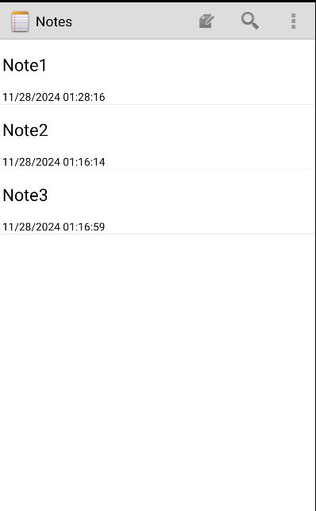

修改Note2这条笔记使得修改时间变化,最新的会在上面


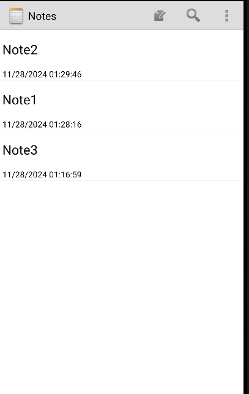

2)思路:数据库在创建的时候便有时间戳数据了,在数据数组中补充时间戳的相关信息并利用工具类进行转换格式为常见的日期格式

1.Cursor不变,在NoteList类的相关数组中定义时间戳数据并且加入时间戳的相关部分:

```
private static final String[] PROJECTION = new String[] {
        NotePad.Notes._ID,
        NotePad.Notes.COLUMN_NAME_TITLE, 
        NotePad.Notes.COLUMN_NAME_MODIFICATION_DATE//显示修改的时间
};
```

```
private String[] dataColumns = { NotePad.Notes.COLUMN_NAME_TITLE ,
        NotePad.Notes.COLUMN_NAME_MODIFICATION_DATE//日期数据 } ;
private int[] viewIDs = { android.R.id.text1 , R.id.time//日期viewid };
```

2.创建工具类对时间戳进行格式转换:

```
package com.example.android.notepad;

import java.text.SimpleDateFormat;
import java.util.Date;

public class TimeUtil {

    public static String getCurrentTimeFormatted() {
        Long nowtime = Long.valueOf(System.currentTimeMillis());
        Date date = new Date(nowtime);
        SimpleDateFormat format = new SimpleDateFormat("MM/dd/yyyy HH:mm:ss");
        return format.format(date);
    }
}
```

3.在notelist布局文件中加入时间的textview

```
    <TextView
        android:id="@+id/time"
        android:layout_width="match_parent"
        android:layout_height="wrap_content"
        android:paddingLeft="3dip"
        android:paddingBottom="5dip"
        android:textColor="@color/black"/>
```


## 三、笔记搜索：模糊查询

效果:搜索Note

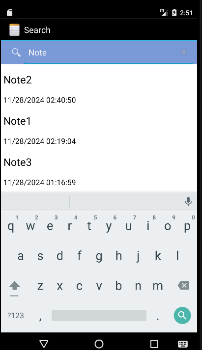

搜索不存在的标题

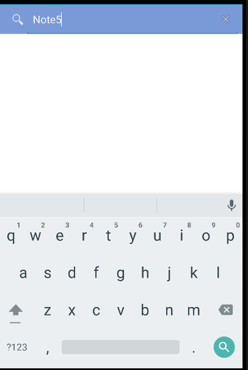

搜索note3

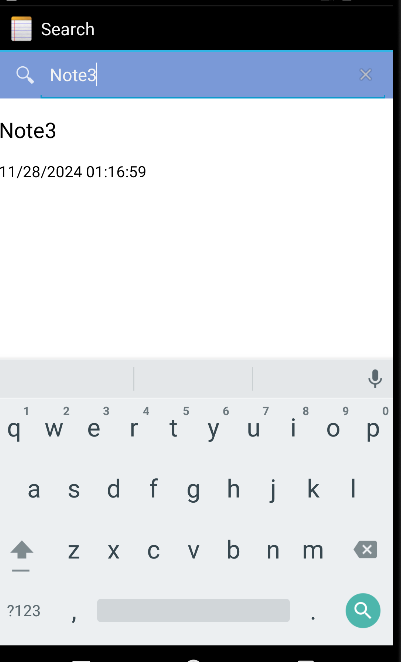

1.添加搜索图标并将这个搜索图标绑定到菜单项的点击事件:

```
<item
    android:id="@+id/search"
    android:title="@string/search"
    android:icon="@android:drawable/ic_search_category_default"
    android:showAsAction="always">
</item>
```

(当用户在`NotesList`活动中点击搜索菜单项时，应用程序将会打开一个新的`NoteSearch`活动，用于执行搜索相关的操作)

思路:当用户点击这个菜单项时

- 系统会触发`onOptionsItemSelected(MenuItem item)`方法。
- 在这个方法内部，一个`switch`语句检查`item`的ID。
- 当`item`的ID匹配`R.id.menu_search`时，执行上述代码块。
- 创建一个`Intent`，设置目标`Activity`为`NoteSearch`，并启动它。

```
case R.id.menu_search:
    Intent intent = new Intent();
    intent.setClass(NotesList.this,NoteSearch.class);
    NotesList.this.startActivity(intent);
    return true;
```

2.创建layout文件:用来显示新的搜索活动,里面有搜索框和搜索出来的笔记列表

```
<?xml version="1.0" encoding="utf-8"?>
<LinearLayout xmlns:android="http://schemas.android.com/apk/res/android"
    android:orientation="vertical"
    android:layout_width="match_parent"
    android:layout_height="match_parent"
    android:background="@color/white"> 

    <SearchView//搜索框
        android:id="@+id/search_view"
        android:layout_width="match_parent"
        android:layout_height="wrap_content"
        android:iconifiedByDefault="false"
        android:background="#7A99D7"
        android:queryHint="搜索"
        android:layout_alignParentTop="true">
    </SearchView>

    <ListView
        android:id="@android:id/list"
        android:layout_width="match_parent"
        android:layout_height="wrap_content"
        android:background="@color/white"> 
    </ListView>

</LinearLayout>
```

3.新建NoteSearch类:这个类提供了一个用户界面，允许用户搜索笔记应用中的笔记，并显示搜索结果。当用户选择一个搜索结果时，根据原始请求的意图，它可以返回选中的笔记或者打开笔记的编辑界面

```
public class NoteSearch extends Activity implements SearchView.OnQueryTextListener {

    private static final String[] PROJECTION = new String[]{
            NotePad.Notes._ID, NotePad.Notes.COLUMN_NAME_TITLE, NotePad.Notes.COLUMN_NAME_MODIFICATION_DATE
    };
    private SearchView searchView;
    private RecyclerView recyclerView;
    private NoteAdapter adapter;
    private Cursor cursor;
    
    @Override
    protected void onCreate(Bundle savedInstanceState) {
        super.onCreate(savedInstanceState);
        setContentView(R.layout.note_search_list);
        recyclerView = findViewById(R.id.recycler_view);
        recyclerView.setLayoutManager(new LinearLayoutManager(this));
        adapter = new NoteAdapter(new ArrayList<>());
        recyclerView.setAdapter(adapter);

        Intent intent = getIntent();
        if (intent.getData() == null) {
            intent.setData(NotePad.Notes.CONTENT_URI);
        }
        searchView = findViewById(R.id.search_view);
        searchView.setOnQueryTextListener(this::onQueryTextChange);

        getLoaderManager().initLoader(0, null, this);
    }

    @Override
    public boolean onQueryTextChange(String newText) {
        getLoaderManager().restartLoader(0, null, this);
        return true;
    }

    @Override
    public boolean onQueryTextSubmit(String query) {
        return false;
    }

    @Override
    public Loader<Cursor> onCreateLoader(int id, Bundle args) {
        return new CursorLoader(this,
                getIntent().getData(),
                PROJECTION,
                NotePad.Notes.COLUMN_NAME_TITLE + " LIKE ?",
                new String[]{"%" + searchView.getQuery().toString() + "%"},
                NotePad.Notes.DEFAULT_SORT_ORDER);
    }

    @Override
    public void onLoadFinished(Loader<Cursor> loader, Cursor data) {
        cursor = data;
        adapter.swapCursor(data);
    }
    @Override
    public void onLoaderReset(Loader<Cursor> loader) {
        adapter.swapCursor(null);
    }
    @Override
    protected void onListItemClick(ListView l, View v, int position, long id) {
        Uri uri = ContentUris.withAppendedId(getIntent().getData(), id);
        String action = getIntent().getAction();
        if (Intent.ACTION_PICK.equals(action) || Intent.ACTION_GET_CONTENT.equals(action)) {
            setResult(RESULT_OK, new Intent().setData(uri));
        } else {
            startActivity(new Intent(Intent.ACTION_EDIT, uri));
        }
    }
}
```

## 四、笔记导出：
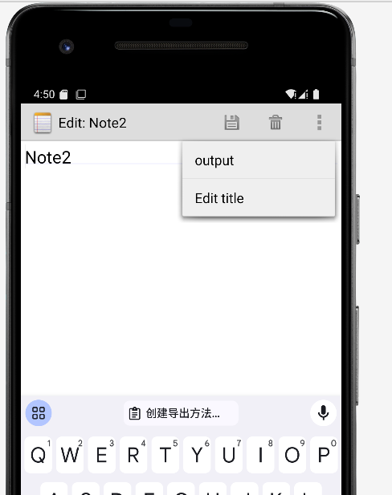

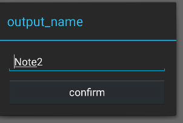

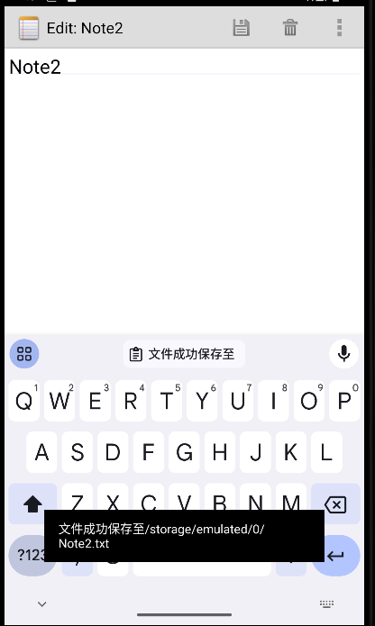

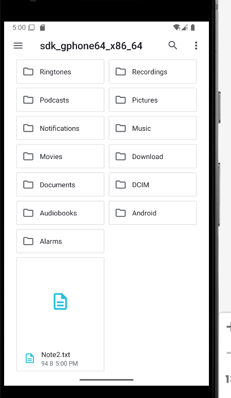

打开Note2:

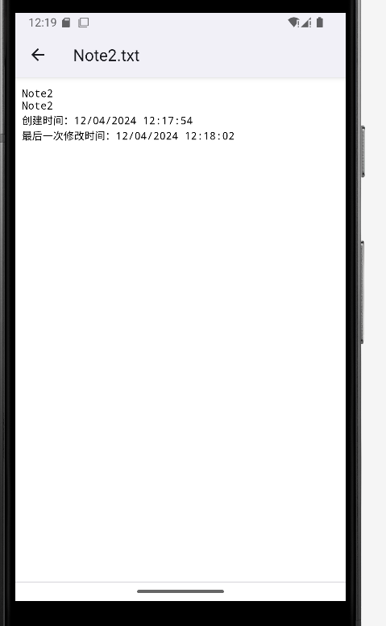

1.添加导出按钮并创建导出方法用于从NoteEditor`的Activity中启动OutputText`的Activity:在用户编辑或查看笔记后，将笔记内容输出到另一个界面或进行进一步处理

```
<item android:id="@+id/menu_output"
    android:title="outpu" />
```

```
private final void outputNote() {
Intent intent = new Intent(null,mUri);
intent.setClass(NoteEditor.this,OutputText.class);
NoteEditor.this.startActivity(intent);
}
```

2.创建导出界面的布局:

```
<?xml version="1.0" encoding="utf-8"?>
<LinearLayout xmlns:android="http://schemas.android.com/apk/res/android"
    android:layout_width="match_parent"
    android:layout_height="wrap_content"
    android:orientation="vertical"
    android:padding="16dp">
 <Button
        android:id="@+id/output_ok"
        android:layout_width="match_parent"
        android:layout_height="wrap_content"
        android:text="@string/confirm"
        android:onClick="onConfirmClick" />
    <EditText
        android:id="@+id/output_name"
        android:layout_width="match_parent"
        android:layout_height="wrap_content"
        android:layout_marginBottom="8dp"
        android:ems="10"
        android:hint="@string/enter_name"
        android:inputType="textCapSentences"
        android:maxLength="50" />
</LinearLayout>
```

3.新建导出类:该类处理将笔记内容输出到外部存储设备（如SD卡）中的文本文件的逻辑

```
public class Output extends Activity {
    private static final String[] PROJECTION = new String[]{
            NotePad.Notes._ID,
            NotePad.Notes.COLUMN_NAME_TITLE,
            NotePad.Notes.COLUMN_NAME_NOTE,
            NotePad.Notes.COLUMN_NAME_CREATE_DATE,
            NotePad.Notes.COLUMN_NAME_MODIFICATION_DATE
    };
    private EditText mName;
    private Uri mUri;
    private boolean flag = false;

    @Override
    protected void onCreate(Bundle savedInstanceState) {
        super.onCreate(savedInstanceState);
        setContentView(R.layout.output_text);
        mUri = getIntent().getData();
        mName = (EditText) findViewById(R.id.output_name);

        // 使用LoaderManager来查询数据
        getLoaderManager().initLoader(0, null, new LoaderManager.LoaderCallbacks<Cursor>() {
            @Override
            public Loader<Cursor> onCreateLoader(int id, Bundle args) {
                return new CursorLoader(OutputText.this,
                        mUri,
                        PROJECTION,
                        null,
                        null,
                        null);
            }

            @Override
            public void onLoadFinished(Loader<Cursor> loader, Cursor data) {
                if (data != null && data.moveToFirst()) {
                    mName.setText(data.getString(1));
                }
            }

            @Override
            public void onLoaderReset(Loader<Cursor> loader) {
                // Do nothing
            }
        });
    }

    @Override
    protected void onPause() {
        super.onPause();
        if (flag) {
            write();
        }
        flag = false;
    }

    public void OutputOk(View v) {
        flag = true;
        finish();
    }

    private void write() {
        try {
            if (Environment.getExternalStorageState().equals(Environment.MEDIA_MOUNTED)) {
                File sdCardDir = Environment.getExternalStorageDirectory();
                File targetFile = new File(sdCardDir, mName.getText().toString() + ".txt");
                try (PrintWriter ps = new PrintWriter(new OutputStreamWriter(new FileOutputStream(targetFile), "UTF-8"))) {
                    ContentResolver contentResolver = getContentResolver();
                    Cursor cursor = contentResolver.query(mUri, PROJECTION, null, null, null);
                    if (cursor != null && cursor.moveToFirst()) {
                        ps.println(cursor.getString(1));
                        ps.println(cursor.getString(2));
                        ps.println("创建时间：" + cursor.getString(3));
                        ps.println("最后一次修改时间：" + cursor.getString(4));
                        cursor.close();
                    }
                }
                Toast.makeText(this, "文件成功保存至：" + sdCardDir.getCanonicalPath() + "/" + mName.getText() + ".txt", Toast.LENGTH_LONG).show();
            }
        } catch (Exception e) {
            e.printStackTrace();
            Toast.makeText(this, "保存失败: " + e.getMessage(), Toast.LENGTH_LONG).show();
        }
    }
}
```

## 五 、笔记排序：

按创建时间排序:时间早的在最上面

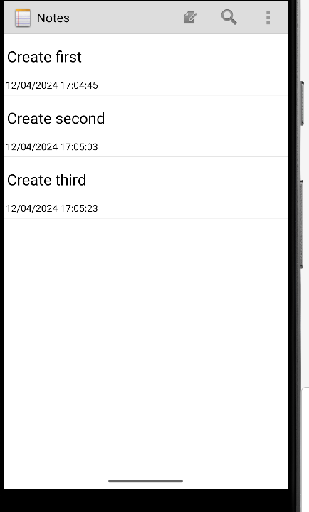

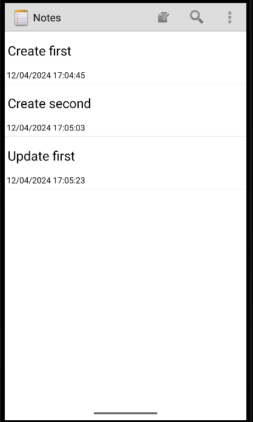

按修改时间排序:时间晚的在上面

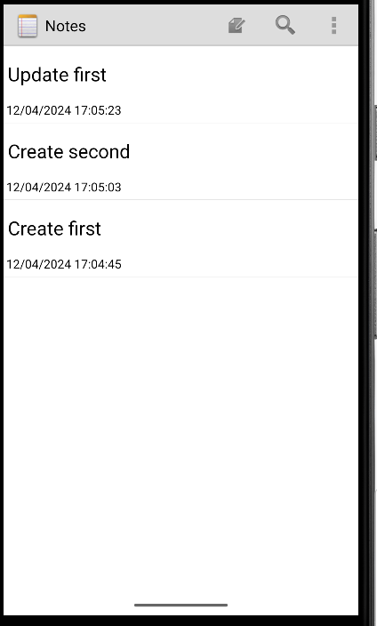!

1.添加菜单选项:

```
<item
    android:id="@+id/menu_sort1"
    android:title="按创建时间排序"/>
<item
    android:id="@+id/menu_sort2"
    android:title="按修改时间排序"/>
```

2.在notesList中添加两种排序情况:用于处理了两个菜单项的点击事件

```
//创建时间排序
case R.id.menu_sort1:
     cursor = managedQuery(
            getIntent().getData(),
            PROJECTION,
            null,
            null,
            NotePad.Notes._ID
    );
     adapter = new SimpleCursorAdapter(
            this,
            R.layout.noteslist_item,
            cursor,
            dataColumns,
            viewIDs
    );
    setListAdapter(adapter);
    return true;
//修改时间排序
case R.id.menu_sort2:
    cursor = managedQuery(
            getIntent().getData(),
            PROJECTION,
            null,
            null,
            NotePad.Notes.DEFAULT_SORT_ORDER
    );
    adapter = new SimpleCursorAdapter(
            this,
            R.layout.noteslist_item,
            cursor,
            dataColumns,
            viewIDs
    );
    setListAdapter(adapter);
    return true;
```

## 六、UI美化：更换背景
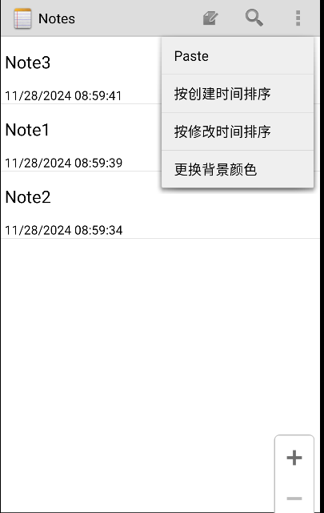
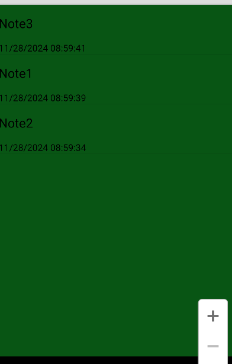
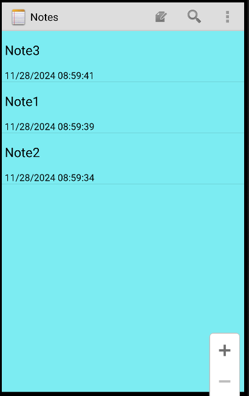

1.添加菜单选项:

```
<item
    android:id="@+id/menu_change_background"
    android:title="更换背景颜色"
    android:showAsAction="never" />
```

2.在list中添加点击情况:

```
case R.id.menu_change_background:
    changeBackgroundColor();
    return true;
```

3.添加changeBackgroundColor方法:

```
private void changeBackgroundColor() {
    Random random = new Random();
    int color = Color.argb(255, random.nextInt(256), random.nextInt(256), random.nextInt(256));
    getWindow().getDecorView().setBackgroundColor(color);
}
```